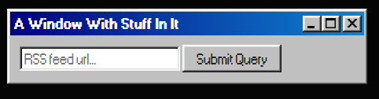
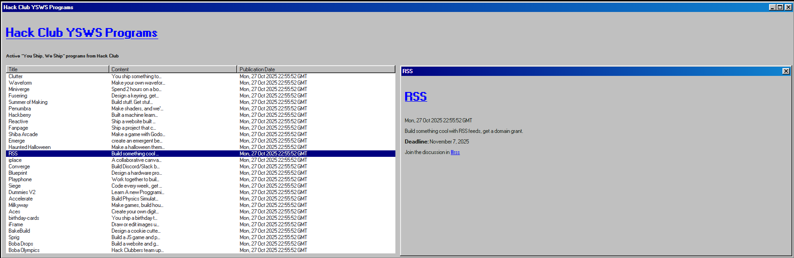

    

# Read-That-Rss
A simple Windows 98 styled rss viewer!

## Design
This tool was made to be as simple as possible, and that it is! All you have to do is copy and paste a url into a search page and press enter!

    

## Resources
Tools that we used in the creation of this!:
 - [Express](npmjs.com/package/express)
 - [DotEnv](npmjs.com/package/dotenv)
 - [EJS](npmjs.com/package/ejs)
 - [Rss-Parser](npmjs.com/package/rss-parser)
 - [Sass](npmjs.com/package/sass)

 - [98.css](https://jdan.github.io/98.css/#tabs)